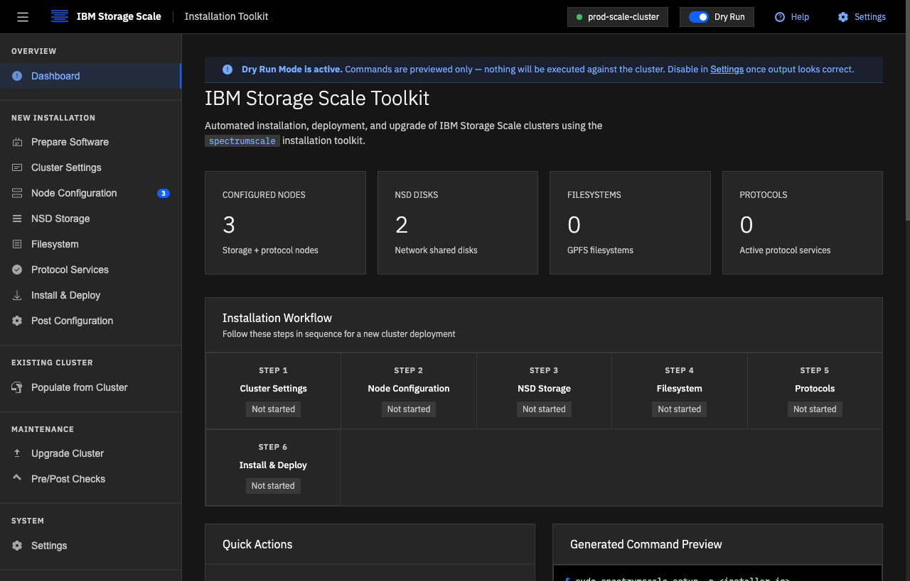
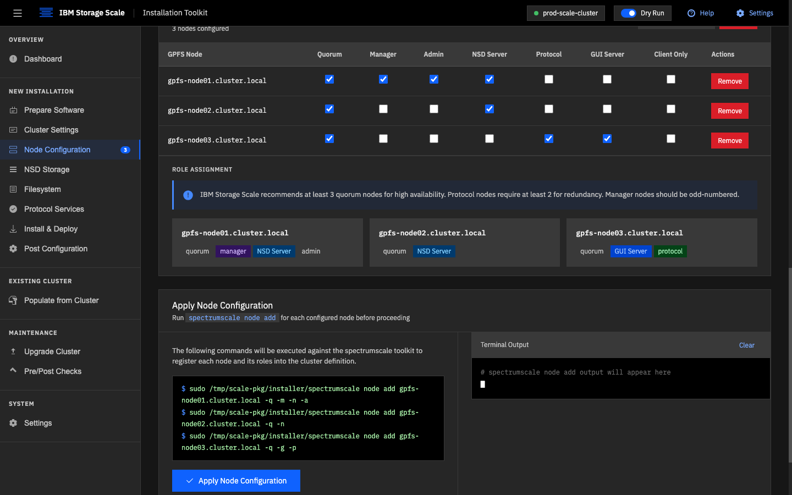
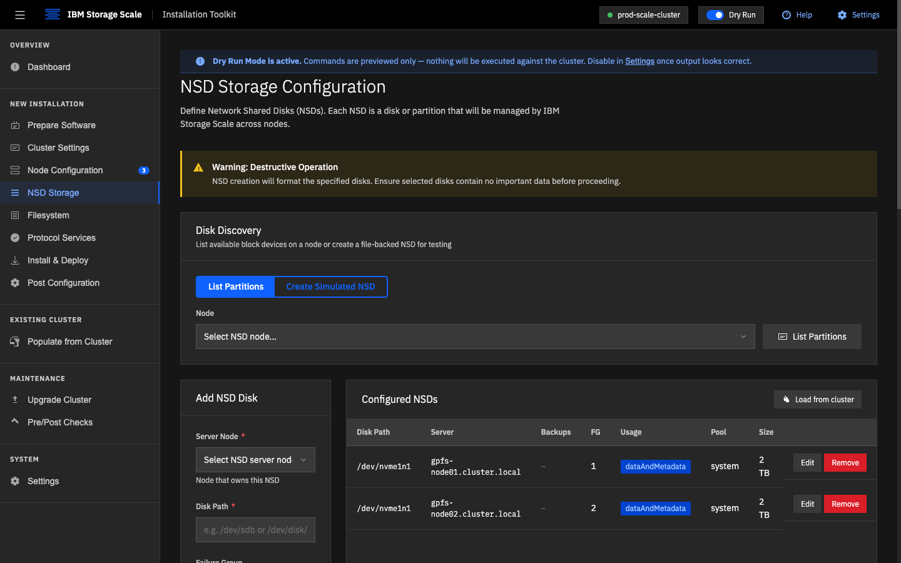
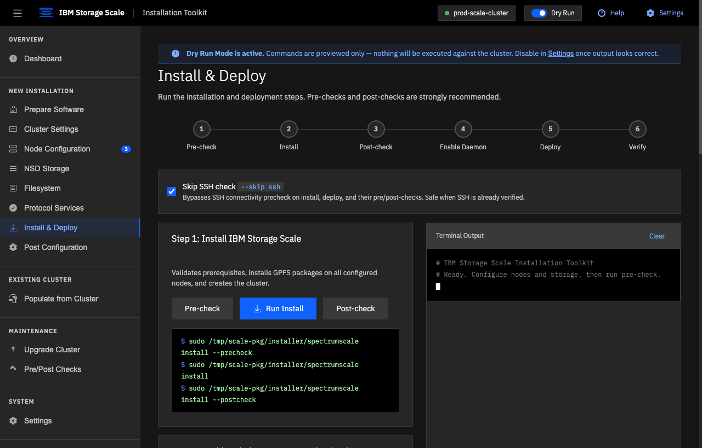
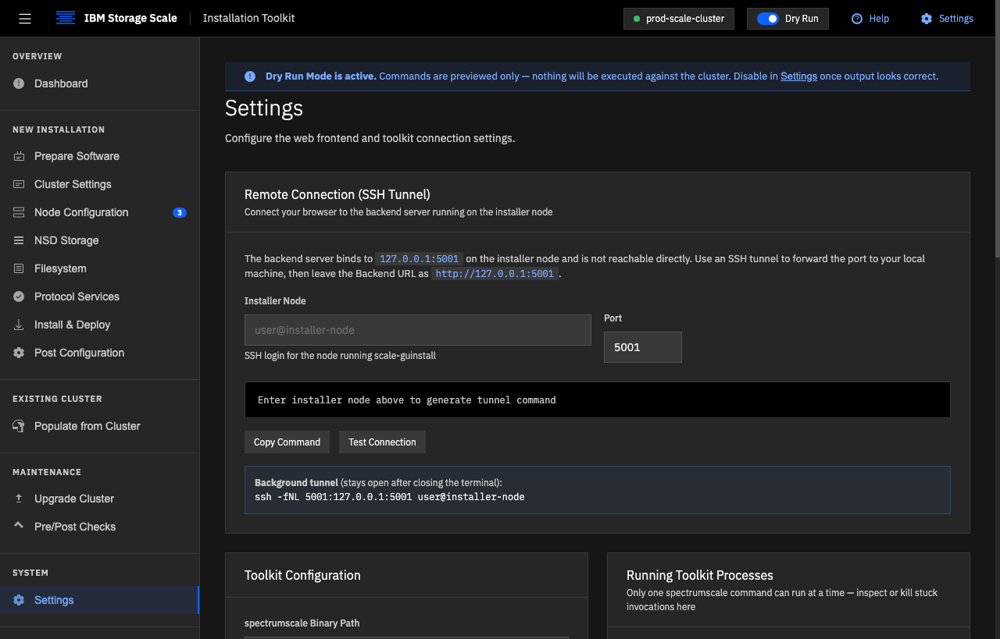

# Scale GUInstall — IBM Storage Scale Installation Toolkit GUI

A single-file web frontend for the IBM Storage Scale Installation Toolkit (`spectrumscale`). Open [Scale-GUInstall.html](Scale-GUInstall.html) in any modern browser to get a guided, form-driven interface for installing, deploying, and upgrading IBM Storage Scale clusters.

> **Disclaimer:** This is an unofficial community helper tool. It is not an IBM product or service. All operations target real cluster infrastructure — read every command preview before executing.

---

## Screenshots

| Dashboard | Node Configuration |
|---|---|
|  |  |

| NSD Storage | Install & Deploy |
|---|---|
|  |  |

<details>
<summary>Settings — SSH tunnel helper</summary>



</details>

---

## Installing via Package (RPM / DEB)

For production installer nodes, use the pre-built packages instead of running from source. The package installs Flask and waitress into a self-contained virtual environment — no manual pip, no cloning, no Python version hunting.

Download the package from the [GitHub Releases page](https://github.com/cdmaestas/Scale-GUInstall/releases) and install it on the installer node:

**RHEL / CentOS / Fedora — with GPG verification (recommended):**
```bash
# Download both files from the release assets, then:
sudo rpm --import RPM-GPG-KEY-scale-guinstall
sudo dnf install ./scale-guinstall-<version>-1.noarch.rpm
```

**RHEL / CentOS / Fedora — skip GPG check (air-gapped or quick install):**
```bash
sudo dnf install --nogpgcheck ./scale-guinstall-<version>-1.noarch.rpm
```

> **RHEL 8/9 note:** Python 3.10+ may need to come from AppStream before installing:
> ```bash
> sudo dnf install python3.11
> ```

**Debian / Ubuntu:**
```bash
sudo apt install ./scale-guinstall_<version>-1_all.deb
```

The post-install script automatically creates a virtual environment at `/usr/lib/scale-guinstall/venv` and installs Flask and waitress into it — no additional steps needed.

Both packages also install `/etc/profile.d/scale-guinstall-mmfs.sh`, which adds `/usr/lpp/mmfs/bin` to `$PATH` so GPFS `mm*` commands work in interactive shells (log out/in or `source /etc/profile.d/scale-guinstall-mmfs.sh` to pick it up). The backend itself always uses full `/usr/lpp/mmfs/bin/...` paths and does not depend on this.

After install:
```bash
scale-guinstall          # run in foreground (prints the SSH tunnel command)

# Or as a persistent service:
sudo systemctl enable --now scale-guinstall
```

**Build the packages yourself:**
```bash
./packaging/build-pkg.sh        # builds both RPM and DEB into dist/
./packaging/build-pkg.sh --rpm  # RPM only (requires rpmbuild)
./packaging/build-pkg.sh --deb  # DEB only (requires dpkg-deb)
```

Prerequisites: `sudo dnf install rpm-build` (RPM) or `sudo apt install dpkg-dev` (DEB).

---

## Getting Started (from source)

The GUI has two components: the HTML file (runs in your browser) and a lightweight backend server (`scale-server.py`) that executes commands on the installer node. The HTML alone works as a command generator in dry-run mode — you only need the server when you're ready to run real commands.

### 1. Install dependencies

On the installer node (the machine that will run `spectrumscale`):

```bash
pip install "flask>=3.0,<4" "waitress>=3.0,<4"
```

`waitress` is optional — the server falls back to Flask's own development server if it isn't installed — but it's the production-grade WSGI server this backend is meant to run under, so install it unless you have a reason not to.

### 2. Start the backend server

```bash
python3 scale-server.py
```

Or use the convenience script that handles the pip install automatically:

```bash
chmod +x start.sh
./start.sh
```

The server listens on `http://127.0.0.1:5001` — loopback only, not accessible from the network.

### 3. Open the GUI

Open `http://127.0.0.1:5001` in a browser — **not** the `Scale-GUInstall.html` file directly. The server serves the app itself and injects a per-process auth token into the page as it does; a copy opened straight from disk has no token and gets a 401 on every real backend call (Dry Run still works fine, since it never touches the backend).

```bash
xdg-open http://127.0.0.1:5001
```

To reach a remote installer node, tunnel the port from your workstation and open the same URL locally (recommended):

```bash
ssh -L 5001:127.0.0.1:5001 user@installer-node
```

Then open `http://127.0.0.1:5001` in your local browser — the tunnel forwards it transparently, and you're still loading the page (and its token) from the remote server, not a local copy. To tunnel in the background without keeping a shell open:

```bash
ssh -fNL 5001:127.0.0.1:5001 user@installer-node
```

> **Why a tunnel?** Binding the server to `0.0.0.0` would expose privileged execution endpoints to anyone on the network. The tunnel keeps the server loopback-only while still allowing remote access over an encrypted channel.

> **Dry Run mode is on by default.** Every button shows the command it would run without executing anything. Disable it in Settings only when you're ready to apply changes to the cluster.

### 4. Work through the pages in order

```
Prepare Software → Node Configuration → Cluster Settings → NSD Storage → Filesystem → Protocol Services → Install & Deploy → Post Configuration
```

---

## Features

| Section | What it does |
|---|---|
| **Dashboard** | Live summary of configured nodes, NSDs, filesystems, and protocols; workflow progress tracker |
| **Prepare Software** | Extract the Scale zip package, verify checksum, run the installer, check Ansible and locale prerequisites, and start the `spectrumscale` setup service |
| **Node Configuration** | Add nodes one at a time or via bulk import; assign roles (NSD, Manager, Quorum, Admin, Protocol/CES, GUI, EMS, Call Home, Archive EE); generates `spectrumscale node add` commands |
| **Cluster Settings** | Set GPFS cluster name, I/O profile, remote shell/copy binaries, port range, GPL binary directory, call home, performance monitoring, and file audit logging |
| **NSD Storage** | Discover block devices across all NSD nodes with `lsblk` (size, type, filesystem, mount, in-use detection; only disks ≥ 32 GB by default), multi-select devices and bulk-configure them into NSDs (usage type, auto/manual failure group, storage pool, filesystem, optional `wipefs` format); plus manual add with backup servers, inline edit, and remove |
| **Filesystem** | Configure GPFS filesystem name, mount point, block size, replication, metadata replication, inodes, and advanced options (quotas, compression, encryption, IAM) |
| **Protocol Services** | Enable and configure NFS (v3/v4/v4.1), SMB/Samba, Object Storage (Swift), and CES floating IPs |
| **Install & Deploy** | Guided pre-check → install → enable daemon → deploy → verify flow using `spectrumscale install` / `spectrumscale deploy` / `scaleadmd enable` |
| **Post Configuration** | Set up GPFS PATH, create GUI admin users, tune `mmchconfig` performance parameters, configure health monitoring, NFS core dump collection, and AFM gateways (NFS or S3) |
| **Populate from Cluster** | CCR status check, then pull an existing cluster's configuration via `spectrumscale config populate` |
| **Upgrade** | Online (rolling, no downtime) or offline cluster upgrade via `spectrumscale upgrade` |
| **Pre/Post Checks** | Run standalone pre-checks and post-checks at any time |
| **Settings** | Toggle dry run mode, set toolkit binary path |

---

## Requirements

**On the installer node:**

- **IBM Storage Scale** — Developer Edition (free, up to 12 TB) or licensed. [Download →](https://www.ibm.com/products/storage-scale)
- **`spectrumscale` toolkit** — installed and accessible (produced by the Prepare Software steps)
- **Python 3.10+** — required for the setup service and the backend server
- **Flask 3.x** — `pip install "flask>=3.0,<4"` (backend server only)
- **waitress 3.x** (recommended) — `pip install "waitress>=3.0,<4"`; the production WSGI server the backend runs under, falls back to Flask's dev server if missing
- **Passwordless sudo** — the backend runs all privileged commands with `sudo -n` (non-interactive); the user running `scale-guinstall` must have `NOPASSWD` sudo rights, or every toolkit and `mm*` command will fail with "sudo is not available without a password"
- **SSH key-based auth** — from the installer node to all target nodes before running setup
- **`unzip`** — needed for package extraction (`sudo apt install unzip` / `sudo yum install unzip`)
- **Ansible compatibility** — ansible-core **2.23 or earlier** is required; ansible-core 2.24+ is incompatible with the toolkit

**On Ubuntu specifically:**

```bash
export LC_ALL=en_US.UTF-8      # set before installing
sudo apt install python3-apt   # required by the toolkit's Ansible playbooks
```

---

## Workflow Reference

```bash
# Prepare
spectrumscale setup -s <installer-ip>

# Build cluster definition
spectrumscale node add <hostname> -r <roles>
spectrumscale config gpfs -c <cluster-name>
spectrumscale nsd add -F <stanza-file>

# Install
spectrumscale install --precheck
spectrumscale install
spectrumscale install --postcheck

# Enable daemon (6.0.1+)
spectrumscale scaleadmd enable
spectrumscale nodeid define

# Deploy protocols
spectrumscale deploy --precheck
spectrumscale deploy
spectrumscale deploy --postcheck
```

Node role flags: `-n` NSD server, `-m` Manager, `-q` Quorum, `-a` Admin, `-p` Protocol (CES), `-g` GUI, `-e` EMS, `-c` Call Home

---

## Dry Run Mode

Dry Run is enabled by default. In this mode every button generates and displays the command that *would* run — nothing is sent to the cluster. Toggle it from the always-visible switch in the top header, or from **Settings**. Turning it off requires confirmation, and the header badge turns red with a **LIVE** label as a persistent reminder that commands will execute for real.

> NSD creation and filesystem operations are **destructive and irreversible**. Always run pre-checks before disabling Dry Run.

---

## Backend Server

`scale-server.py` is a Flask app that runs locally on the installer node. It provides SSE-streaming endpoints that the GUI calls to execute `spectrumscale` commands and stream output back to the browser terminal.

**Security properties:**
- Binds to `127.0.0.1` only — not reachable from the network
- Every API call requires a per-process auth token, generated fresh at startup and injected into the page when the server serves it — a page opened any other way (e.g. as a local `file://`) can preview commands in Dry Run but gets a 401 on every real backend call
- CORS restricted to `localhost` and `127.0.0.1` origins
- Credentials (GUI user passwords, S3 secret keys) are sent in POST request bodies, never in URLs or query strings
- All executed commands are explicit and allowlisted — no generic shell execution endpoint
- `config gpfs` flags are validated against an explicit allowlist — unrecognised flags are rejected before reaching the subprocess
- Node hostnames are validated against a strict regex (`[a-zA-Z0-9._-]`) before use in subprocess arguments or file paths
- `mmchconfig` values are validated to contain only alphanumeric characters and dots
- All user-supplied filesystem paths are validated against an allowlist of safe roots (`/tmp`, `/opt`, `/usr`, `/home`, etc.) to prevent path traversal
- `binpath` inputs for profile.d setup are restricted to safe characters via regex before use in any file operation
- SSH host key checking uses `accept-new` (new hosts accepted once; changed keys rejected) rather than disabling verification entirely

**The server is only needed for live execution.** In Dry Run mode the GUI generates command previews entirely in the browser with no server required.

**Configuration autosave.** The GUI's working state (nodes, NSDs, filesystem, protocols, cluster name, toolkit path) is autosaved to `/var/lib/scale-guinstall/config.json` roughly once a second and restored automatically the next time the page loads — closing a tab or restarting the browser no longer loses your progress. This is separate from the manual **Export/Import Config** buttons in Settings, which remain the way to back up or move a configuration to a different installer node. Writes use optimistic locking: if two tabs (or two people) have the page open, the second one to save after the first gets a "changed elsewhere" banner instead of silently overwriting the other's work, and autosave pauses there until that tab is reloaded. Requires the server process to have write access to `/var/lib/scale-guinstall` — true by default under the packaged systemd service, not guaranteed when running from source as a non-root user.

---

## Connecting Remotely (SSH Tunnel)

The backend server binds to `127.0.0.1` only. To use the GUI from your workstation, forward the port over SSH:

```bash
# Interactive (tunnel closes when terminal closes)
ssh -L 5001:127.0.0.1:5001 user@installer-node

# Background (stays open)
ssh -fNL 5001:127.0.0.1:5001 user@installer-node
```

Then open `http://127.0.0.1:5001` in your local browser — not a local copy of `Scale-GUInstall.html`, which has no auth token and can't make real backend calls. The **Settings** page has a tunnel helper that generates the command for you and tests the connection.

### Firewall and SSH server requirements

The SSH tunnel only requires **port 22 (SSH)** to be reachable on the installer node — no other ports need to be opened. If the node's firewall blocks SSH from your workstation, allow it:

**RHEL / CentOS / Fedora (firewalld):**
```bash
sudo firewall-cmd --permanent --add-service=ssh
sudo firewall-cmd --reload
sudo firewall-cmd --list-all   # verify
```

**Ubuntu / Debian (ufw):**
```bash
sudo ufw allow ssh
sudo ufw status
```

### Enable TCP port forwarding on the SSH server

Hardened servers (common on RHEL/CentOS) often disable TCP forwarding, which silently breaks `ssh -L` tunnels. Check and enable it on the installer node:

```bash
# Check current setting
sudo sshd -T | grep allowtcpforwarding
```

If it shows `allowtcpforwarding no`, enable local forwarding. The easiest way is the bundled helper script, which picks the right method automatically and validates the config before reloading sshd:

```bash
sudo ./packaging/enable-ssh-forwarding.sh
```

Or manually — **prefer a drop-in file** when `/etc/ssh/sshd_config.d/` exists (stock on RHEL 8+/Ubuntu 20.04+). sshd uses the *first* value it sees for a keyword, and the `Include sshd_config.d/*.conf` directive sits at the top of `sshd_config`, so a drop-in overrides any `AllowTcpForwarding no` in the main config:

```bash
echo 'AllowTcpForwarding local' | sudo tee /etc/ssh/sshd_config.d/60-scale-guinstall.conf
sudo sshd -t && sudo systemctl reload sshd
```

On systems without `sshd_config.d`, edit the existing directive in place (do **not** append to the end of the file — the earlier `no` would win):

```bash
sudo sed -i 's/^#*AllowTcpForwarding.*/AllowTcpForwarding local/' /etc/ssh/sshd_config
sudo sshd -t && sudo systemctl reload sshd
```

`local` allows `ssh -L` tunnels while blocking remote port forwarding — more restrictive than `yes` and appropriate for hardened environments.

Verify the tunnel works after reloading:

```bash
ssh -L 5001:127.0.0.1:5001 user@installer-node echo "tunnel OK"
```

> **Direct access without a tunnel (not recommended):** Because Flask binds to `127.0.0.1`, opening port 5001 in the firewall alone does nothing — remote clients still can't reach it. To allow direct access you must also change the host binding in `scale-server.py` to `0.0.0.0`. If you do that, restrict the firewall rule to your workstation's IP only — never open port 5001 to the world, as the server has no authentication.
>
> ```bash
> # Allow port 5001 from a specific workstation IP only (firewalld)
> sudo firewall-cmd --permanent --add-rich-rule='rule family="ipv4" source address="<workstation-ip>" port port="5001" protocol="tcp" accept'
> sudo firewall-cmd --reload
> ```

---

## File Structure

```
Scale-GUInstall/
├── Scale-GUInstall.html        # Self-contained single-file app (HTML + CSS + JS)
├── help.html                   # Standalone help/reference page, linked from the app header
├── scale-server.py             # Backend server (Flask, served by waitress) for live command execution
├── start.sh                    # Convenience script: finds Python, installs Flask/waitress, starts server
├── CHANGELOG.md                # Release history (Keep a Changelog format)
├── .githooks/                  # Local git hooks (pre-commit, pre-push) mirroring CI
├── tests/                      # pytest unit tests for scale-server.py
├── docs/screenshots/           # README screenshots
└── packaging/
    ├── build-pkg.sh            # Builds RPM and DEB packages into dist/
    ├── scale-guinstall.spec    # RPM spec
    ├── scale-guinstall.service # systemd unit (installed but not enabled by default)
    ├── scale-guinstall-wrapper # /usr/bin/scale-guinstall installed by package
    ├── scale-guinstall-mmfs.sh # /etc/profile.d snippet adding /usr/lpp/mmfs/bin to PATH
    ├── scale-guinstall.1       # man page source (troff)
    └── debian/                 # DEB control files (control, postinst, prerm, postrm)
```

**Developing?** Enable the local git hooks so the CI checks run before each commit and push:

```bash
git config core.hooksPath .githooks
```

Run the unit tests directly with:

```bash
pip install "flask>=3.0,<4" "waitress>=3.0,<4" pytest
pytest
```

The pre-push hook runs them automatically if `pytest` is importable, and warns (without blocking) if it isn't — CI runs them either way.

---

## Notes

- The GUI uses IBM Carbon Design System tokens and IBM Plex fonts for a native-looking IBM interface.
- The tool targets IBM Storage Scale 6.0.1 and the `spectrumscale` Installation Toolkit.
- Click **Help** in the top header (or open [help.html](help.html) directly) for an in-app quick reference and troubleshooting guide.
- Official IBM documentation: [IBM Storage Scale 6.0.1 docs →](https://www.ibm.com/docs/en/storage-scale/6.0.1)
