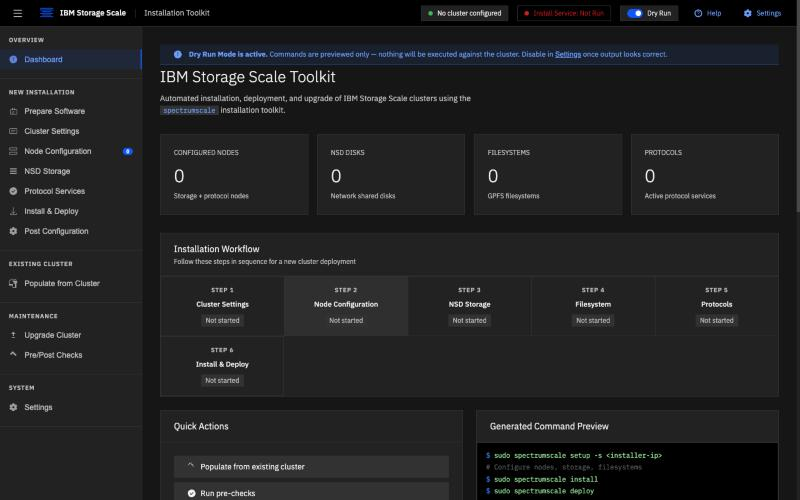
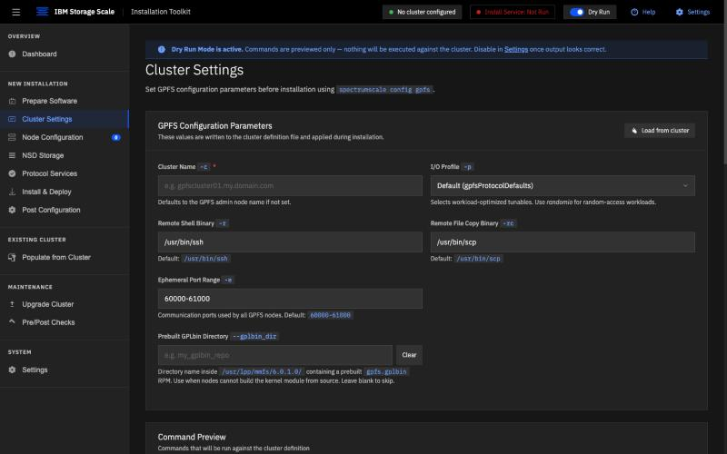
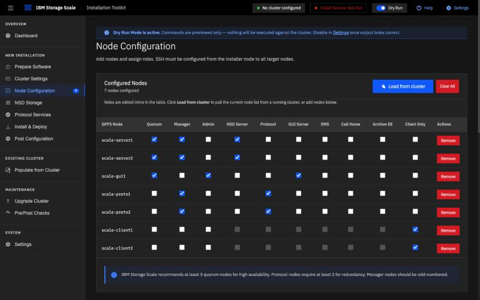
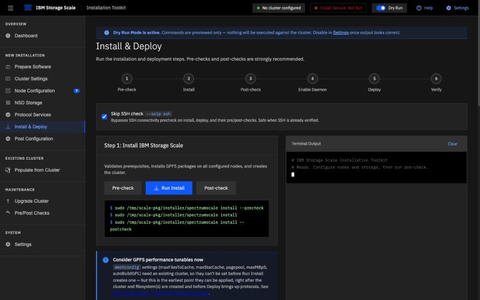
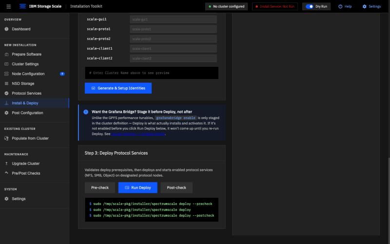

# GUI Click-Through: The Golden Path, Screen by Screen

A step-by-step tour of `Scale-GUInstall.html` — the web frontend — walking
through the exact same golden path as
[`techzone-walkthrough-clean.md`](techzone-walkthrough-clean.md), but
from the UI instead of a terminal. Captured against the static demo
server (`python3 -m http.server`, no live backend attached — see
[`.claude/launch.json`](../.claude/launch.json)'s `Scale-GUInstall`
config), so every screen is driven and filled exactly as a real
operator would, but no `spectrumscale` command actually runs.

Each step below pairs a screenshot with the narration you'd use if
talking over it live, the same pacing convention as the terminal
`.cast` recordings.

A self-paced recording of this sequence is at
[`recordings/gui-walkthrough.html`](recordings/gui-walkthrough.html) —
see [Watching the recording](#watching-the-recording) below.

---

### 1. Dashboard



> "This is the toolkit's dashboard — zero nodes, zero NSDs, zero
> filesystems, zero protocols configured. The six-step installation
> workflow across the top is the same golden path as the terminal
> walkthrough: Cluster Settings, Node Configuration, NSD Storage,
> Filesystem, Protocols, Install & Deploy. The command preview panel on
> the right already shows the exact `spectrumscale` commands this UI
> is going to generate."

### 2. Prepare Software


> "Before touching the cluster at all, the toolkit itself needs to be
> on the installer node. This page extracts the Developer Edition
> package and runs the same ansible-core and locale prerequisite
> checks the real runbook calls out — the `ansible-core 2.23` pin and
> the `LC_ALL` / `python3-apt` warning that trip up Ubuntu installer
> nodes."

### 3. Cluster Settings



> "Cluster-wide GPFS parameters, set once before anything else runs.
> Notice the ephemeral port range is already defaulted to
> `60000-61000` — that's the fix for the callhome/port-range precheck
> failure the real walkthroughs hit on the first attempt, baked into
> the UI's defaults instead of left as a trap."

### 4. Node Configuration — seven nodes, roles assigned



> "All seven nodes, bulk-imported by hostname and then given their
> golden-path roles: `scale-server1`/`2` as NSD, quorum, and manager
> nodes; `scale-gui1` as quorum, admin, and the GUI server;
> `scale-proto1`/`2` as manager and protocol nodes; the two clients
> left as client-only. Same role layout as every terminal walkthrough
> in this project."

### 5. NSD Storage


> "Disk discovery and NSD definition — this is also where the
> filesystem layout happens, since NSDs are assigned to a filesystem
> as they're created. 'Scan Block Devices' runs `lsblk` across every
> NSD-server node in parallel to list what's actually free, rather
> than asking the operator to go find device paths by hand."

### 6. Protocol Services — NFS, SMB, and Object (S3) enabled


> "All three protocols enabled together — NFS, SMB, and Object
> Storage, the toolkit's S3-compatible protocol — with the CES shared
> root filesystem and the two floating IP addresses filled in. Notice
> the inline warning under NFS: it calls out the `rpcbind` package
> requirement directly, the exact root cause the second terminal
> walkthrough spent an entire investigation uncovering. That hint
> wasn't here by accident — it's a direct product of that debugging
> session."

### 7. Install & Deploy — the install half



> "The six-stage pipeline: pre-check, install, post-check, enable
> daemon, deploy, verify — laid out as a single flow instead of
> separate pages, so it's obvious post-check isn't optional cleanup,
> it's a first-class step between install and deploy. Each stage's
> real `spectrumscale` command is shown before it runs, not hidden
> behind a generic 'Next' button."

### 8. Install & Deploy — the protocol deploy half



> "Scrolling further down the same page: Step 3, deploying the
> protocol services configured earlier. Same pre-check/run/post-check
> shape as install. The callout above it about the Grafana Bridge is
> another lesson learned baked directly into the UI — enabling it
> alone doesn't activate it, only this Deploy step does."

### 9. Post Configuration


> "And last, the GPFS performance tunables — `maxFilesToCache`,
> `maxStatCache`, `pagepool`, `maxMBpS` — applied here because this is
> the earliest point in the whole flow where a cluster and filesystem
> actually exist to apply them to, right after install and before
> deploy brings the protocols up."

---

## Why this is worth having alongside the terminal recordings

The terminal walkthroughs prove the *backend* sequence is correct —
real `spectrumscale` commands, real output, real timing. This
walkthrough proves the *UI* asks for the same inputs in the same
order and surfaces the same hard-won lessons (the rpcbind hint, the
Grafana Bridge timing note, the pre-filled port range) at the point an
operator would actually need them, not buried in a separate runbook
they have to read first.

## Watching the recording

[`recordings/gui-walkthrough.html`](recordings/gui-walkthrough.html)
is a self-contained, narration-paced slideshow of the nine screenshots
above — each slide holds for roughly as long as its narration takes to
read, the same pacing convention as the terminal `.cast` recordings.
The companion script is
[`narration-gui-walkthrough.md`](narration-gui-walkthrough.md).

Open it from a local server so the relative image paths resolve (some
browsers restrict local-file image loading from a bare double-click):

```bash
python3 -m http.server 8765   # from the repo root
```

then visit `http://localhost:8765/docs/recordings/gui-walkthrough.html`
and screen-record it while reading the narration aloud. Space bar
pauses/resumes; arrow keys move between slides manually.
