# GUI walkthrough: configuring a real cluster

A tour of the Scale GUInstall interface, built from screenshots taken while a real IBM Storage Scale 6.0.1.1 cluster was installed on **2026-10-06** (installer plus seven nodes on a TechZone environment that no longer exists). For the commands that ran underneath, see the [CLI walkthrough](../cli/README.md); for the conversation that drove them, the [MCP walkthrough](../mcp/README.md).

| Recording | Length | Slides | Watch | Narration |
|---|---:|---:|---|---|
| **GUI tour** | 9:45 | 26 | [Player](player.html) · [GIF](tour.gif) | [Script](narration.md) |

## What is real and what is not

- **The screenshots are real.** They were taken from the GUI in a browser against the installer node's backend, through an SSH tunnel.
- **Dry Run was on for nearly every step.** The one live action was Apply Protocols (slides 15 and 16); Dry Run was switched back on afterwards.
- **The install and deploy did not run from the GUI.** They were run through the MCP tools, so the GUI's header still says "No cluster configured" and "Install Service: Not Run": it shows GUI-side state, not what the backend did.
- **The GUI previews and the backend's real commands agree.** Both use the same flags per node, in a different order (slide 6), and the real NSD commands also set the filesystem and pool.
- **The Skip SSH check option** is ticked in the screenshot of the install page; the real run's install and deploy commands did not use it.
- **Enable Daemon and node identity (TLS)** is marked required for 6.0.1+ on the install page; the MCP runs skipped it and the deploys still passed. This is untested territory (slide 19).
- **Not run:** Populate from Cluster and Pre/Post Checks are shown idle.

## The tour

### Introduction

> This is a tour of the Scale GUInstall interface, using screenshots taken while a real cluster was installed on 6 October 2026. The GUI stayed in Dry Run for almost every step; the one live action was Apply Protocols. The install and deploy themselves were run through the MCP tools, so the GUI's header still reads No cluster configured. The command-line walkthrough shows what actually ran.

### 1. The disclaimer

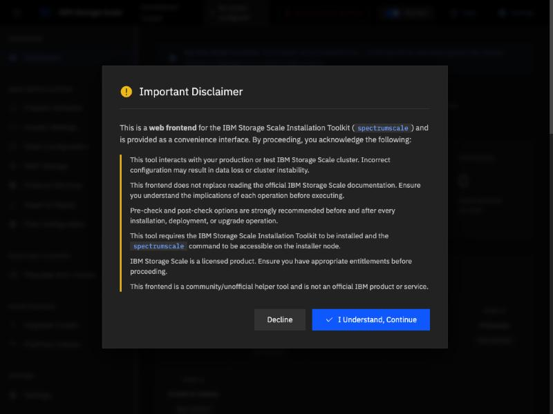

> On first load the GUI asks you to accept a disclaimer. It says this is a community front end for the installation toolkit, not an IBM product, and that you are responsible for understanding the commands it runs. Choose I Understand, Continue.

### 2. An empty dashboard

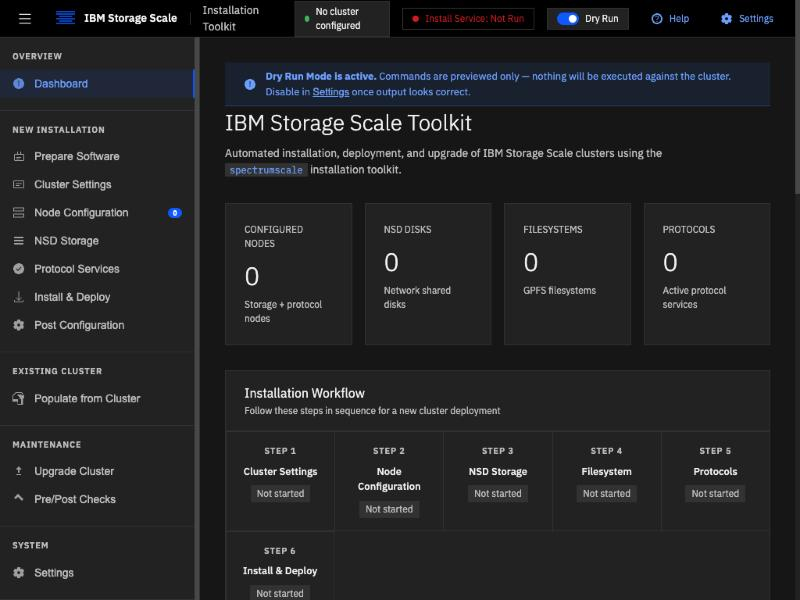

> The dashboard starts empty: zero configured nodes, zero NSD disks, zero filesystems and zero protocols. Below that, the installation workflow lists six steps, all not started. Dry Run Mode is on, as the banner says: commands are previewed only, and nothing runs against the cluster.

### 3. Prepare Software

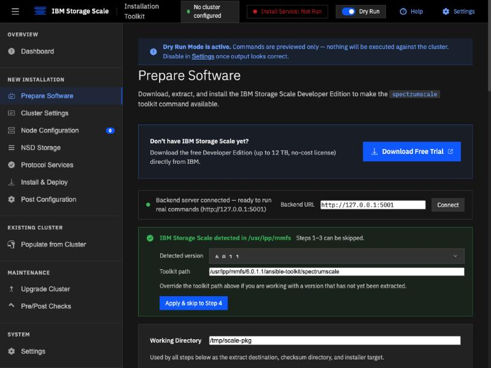

> Prepare Software connects the page to the backend on the installer node. Here the backend is connected at 127.0.0.1 port 5001, which was an SSH tunnel to the installer. The toolkit was already detected in /usr/lpp/mmfs, version 6.0.1.1, so steps one to three can be skipped with Apply and skip to Step 4.

### 4. Cluster Settings

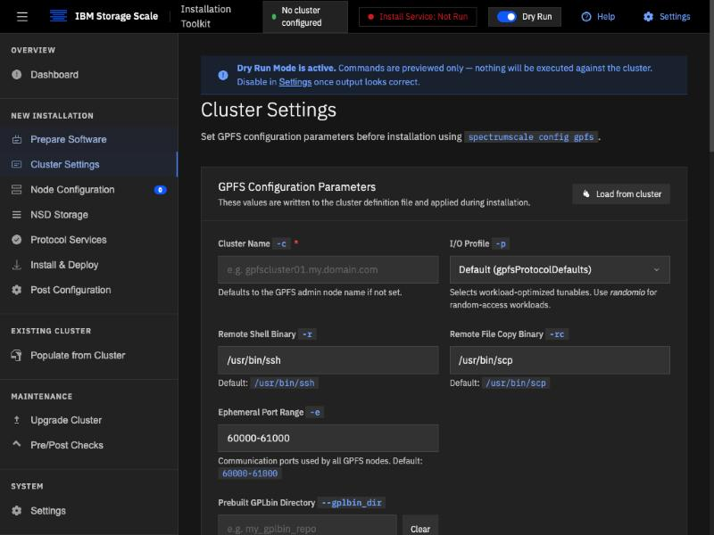

> Cluster Settings holds the GPFS configuration parameters. The cluster name can stay blank, in which case the toolkit uses the admin node's name, which is how this cluster got its name. The ephemeral port range defaults to 60000 to 61000, the I/O profile is the protocol default, and the remote shell and copy commands are ssh and scp.

### 5. Node roles

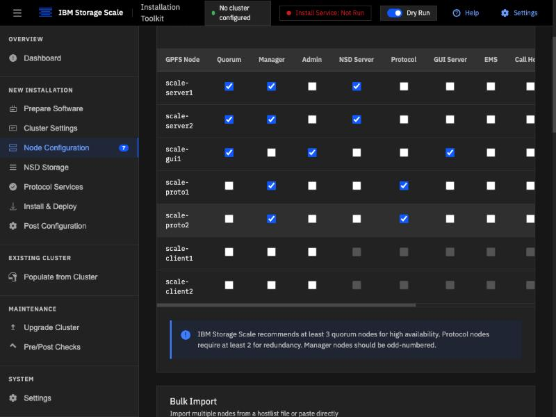

> Node Configuration lists the seven nodes in a grid of role checkboxes. The two storage servers are quorum, manager and NSD servers. The GUI node is quorum, admin and GUI server. The two protocol nodes are managers and protocol nodes, and the two clients have no roles. A note recommends at least three quorum nodes.

### 6. Node command preview

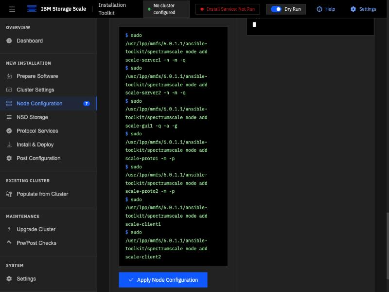

> Below the grid, the preview shows one node add command per node. The commands the backend echoed in the real run used the same flags for each node but in a different order; for example it ran node add scale-gui1 with dash g, dash q, dash a. In live mode, Apply Node Configuration would run these.

### 7. NSD Storage

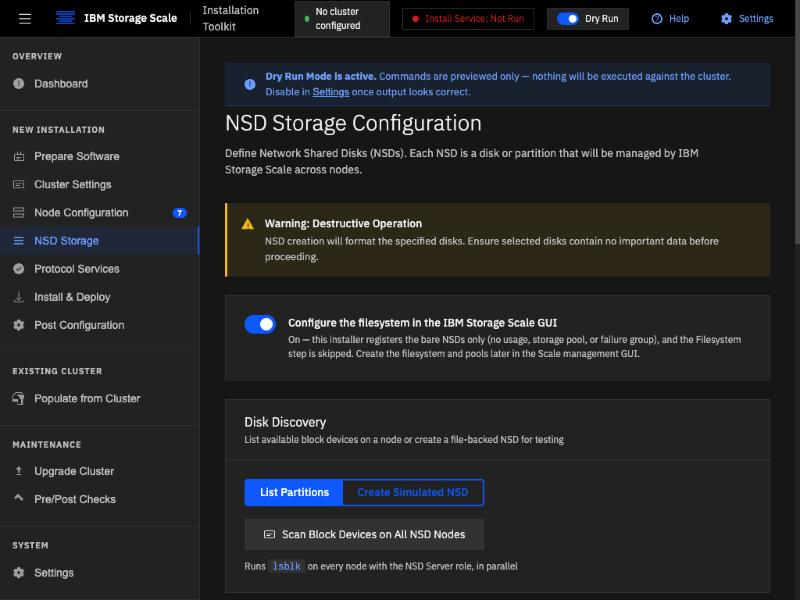

> NSD Storage starts with a warning: creating NSDs formats the disks. A switch, on by default, says to configure the filesystem in the IBM Storage Scale GUI instead, which makes this installer skip its own filesystem step.

### 8. Scanning for disks

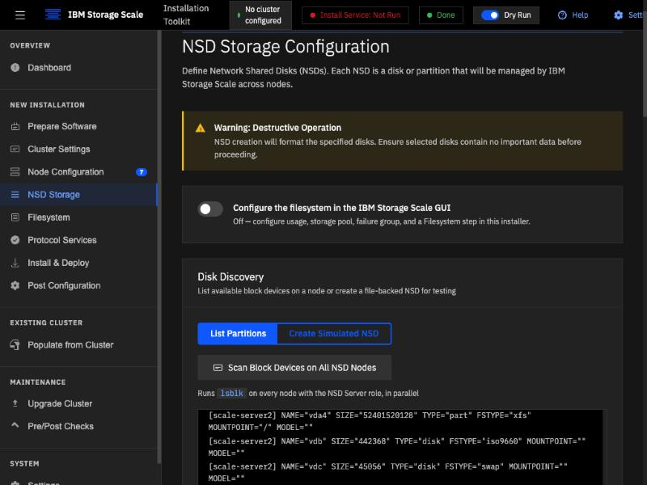

> Here the switch is off, so usage, storage pool, failure group and a Filesystem step stay in this installer, matching how the real run was set up. Scan Block Devices runs lsblk on every NSD server in parallel, and the raw output appears below.

### 9. The device table

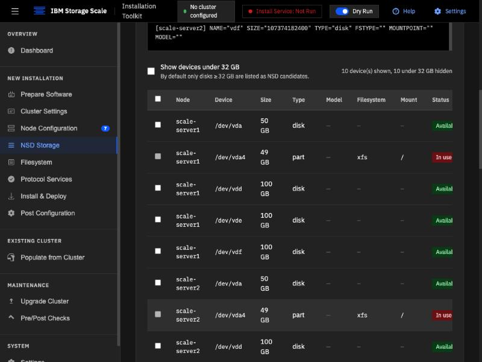

> The scan results become a table of node, device, size, type, filesystem, mount and status. The system disks are marked In use. By default only disks of 32 gigabytes or more are shown, and ten smaller devices are hidden. Each storage server offers three available 100 gigabyte disks.

### 10. Configure as NSDs

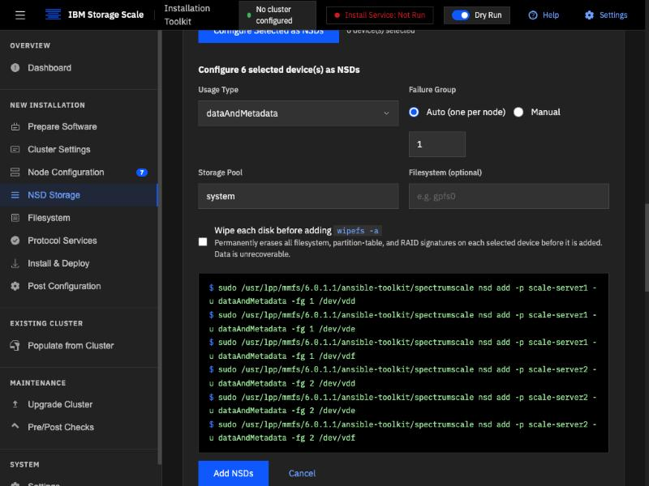

> With six disks selected, Configure as NSDs sets the usage type, here data and metadata, and the failure group, here automatic, one per node. The preview shows six nsd add commands, one per disk. The real run later made the third disk on each server data only, in a pool named data.

### 11. NSDs configured

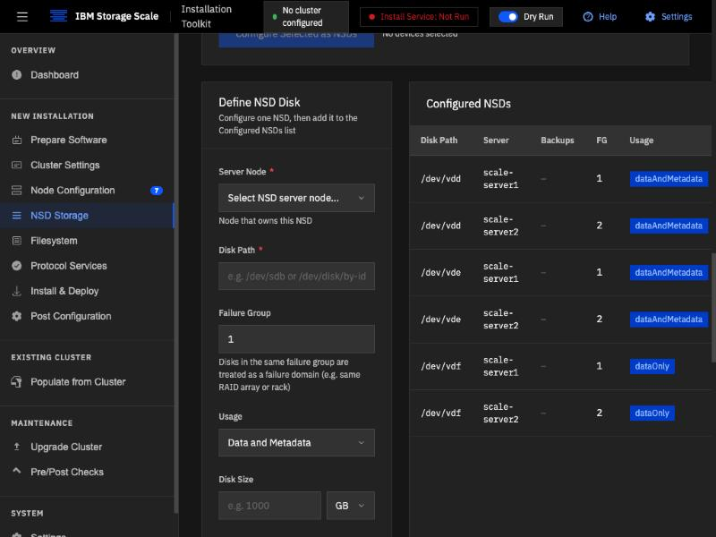

> The Configured NSDs table lists the six disks with their server, failure group and usage: the first two disks on each server as data and metadata, and the third as data only.

### 12. Filesystem settings

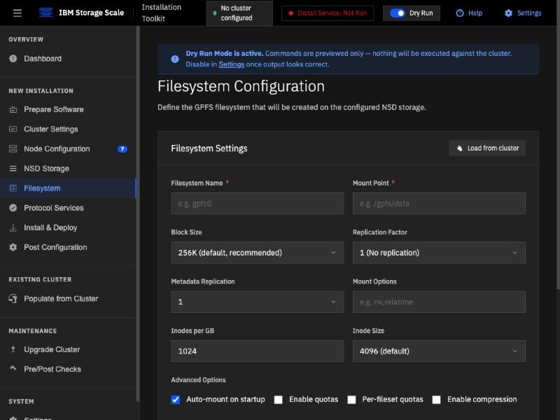

> The Filesystem page sets block size, replication, inode settings and mount options for the filesystems the toolkit creates. In the real run the two filesystem names, cesSharedRoot and fs1, were given with the NSD add commands, so this page is shown with its defaults.

### 13. Protocol options

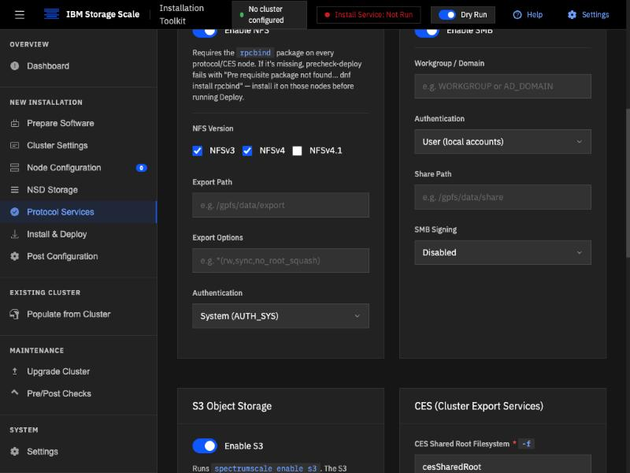

> Protocol Services selects NFS, SMB and S3 and their options: the NFS versions, SMB authentication, and the Cluster Export Services settings for the shared root filesystem, the interface and the export addresses.

### 14. Protocol preview in Dry Run

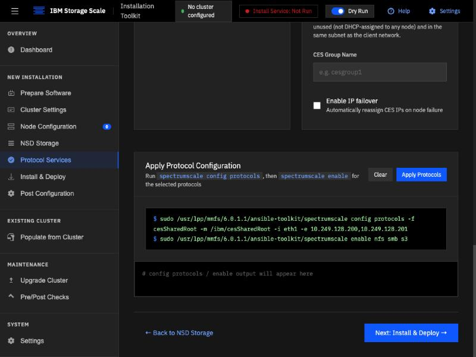

> Apply Protocol Configuration previews two commands: config protocols, with the shared root filesystem cesSharedRoot, its mount point, interface eth1 and the two export addresses; then enable nfs smb s3. In Dry Run the output pane only says that output will appear here.

### 15. Leaving Dry Run

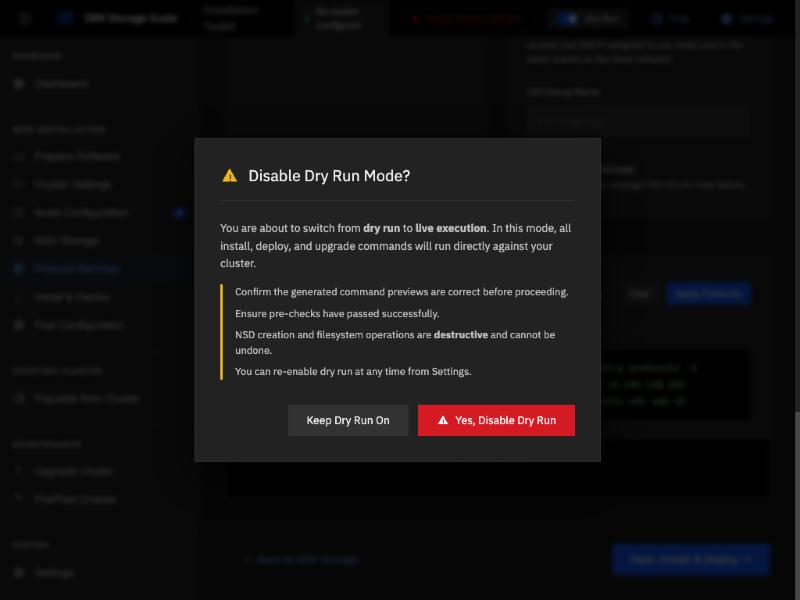

> To run them for real, Dry Run has to be switched off. The GUI asks you to confirm. It warns that install, deploy and upgrade commands will run directly against the cluster, that NSD and filesystem operations are destructive, and that you can turn Dry Run back on at any time.

### 16. Protocols applied live

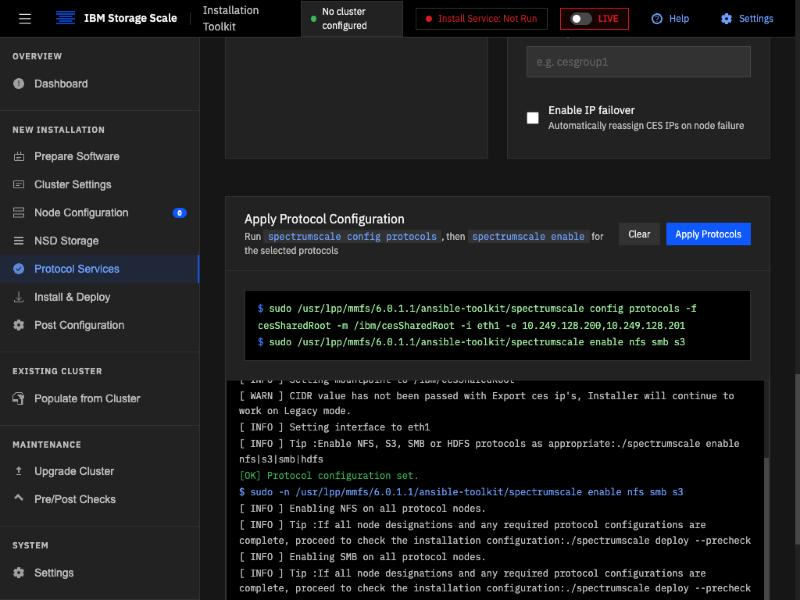

> With Dry Run off, the header shows Live in red. Apply Protocols ran both commands on the installer. The output shows the CIDR warning, which only means the toolkit stays in legacy mode, then Protocol configuration set, and NFS, SMB and S3 enabled on the protocol nodes. Dry Run was switched back on afterwards.

### 17. The dashboard afterwards

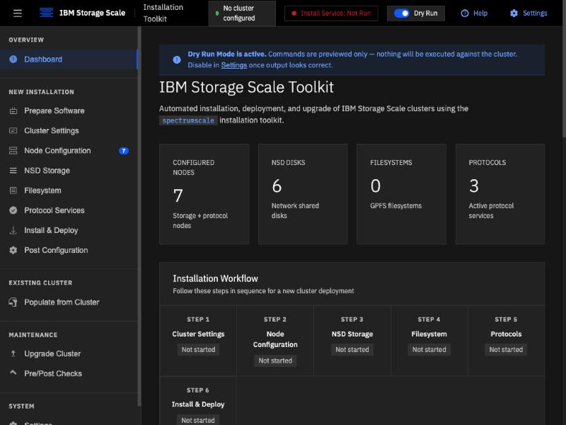

> The dashboard now reflects what the GUI holds: seven configured nodes, six NSD disks, zero filesystems and three protocols. Filesystems stay at zero because none were defined in this GUI; the toolkit creates them from the NSD definitions during the install.

### 18. Install, step 1

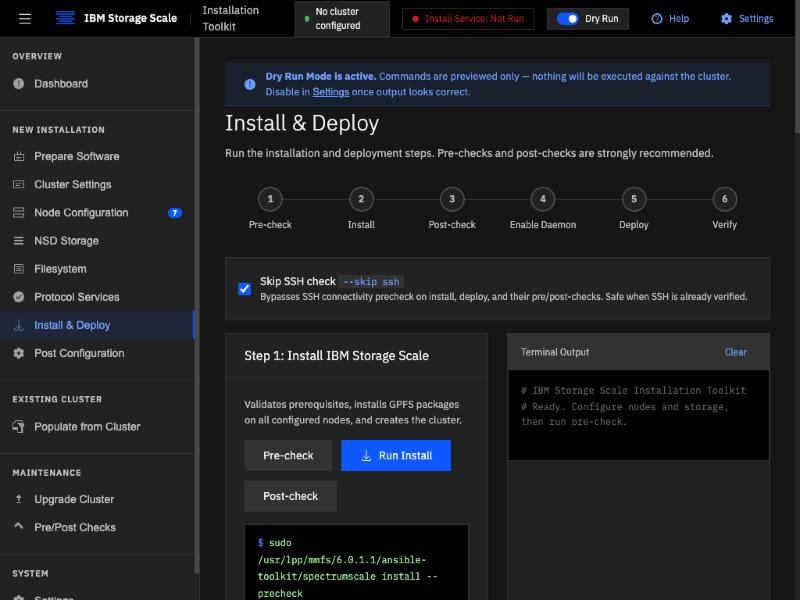

> Install and Deploy walks through six stages: pre-check, install, post-check, enable daemon, deploy and verify. Step one has Pre-check, Run Install and Post-check, with the command each will run. The Skip SSH check option is ticked in this screenshot; the real run's commands did not use it.

### 19. Admin daemon and node identity

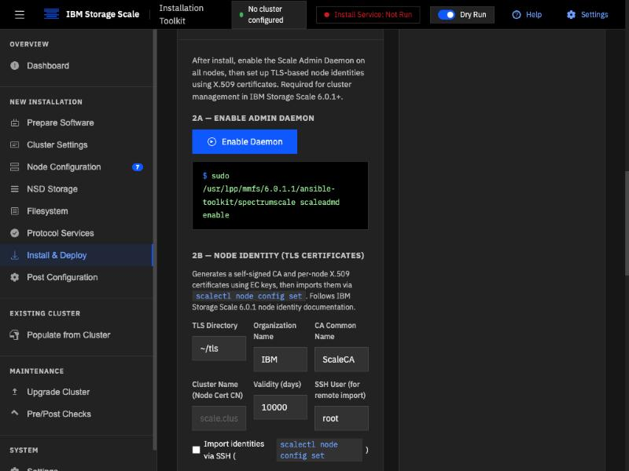

> Step two enables the Scale admin daemon and sets up node identity with TLS certificates. The page marks this as required for 6.0.1 and later. The MCP runs behind this walkthrough skipped it, and the deploys still passed, so it is worth testing on its own.

### 20. Deploy protocol services

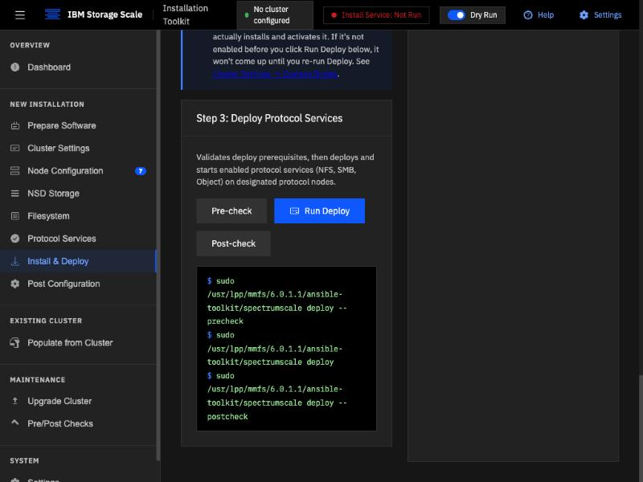

> Step three deploys the protocol services, with Pre-check, Run Deploy and Post-check. The previews show deploy with dash dash precheck, deploy, and deploy with dash dash postcheck, the same three commands the real run used.

### 21. Post Configuration

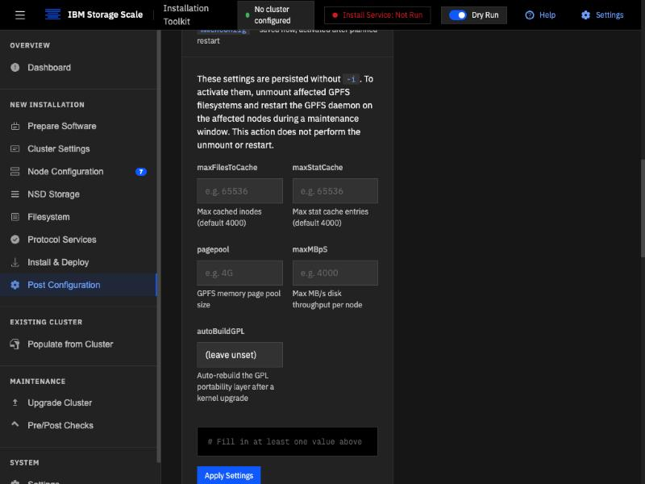

> Post Configuration saves performance settings such as caches, memory and throughput. Saving does not activate them. As the note explains, activation needs the affected filesystems unmounted and the GPFS daemon restarted in a planned maintenance window.

### 22. Environment setup

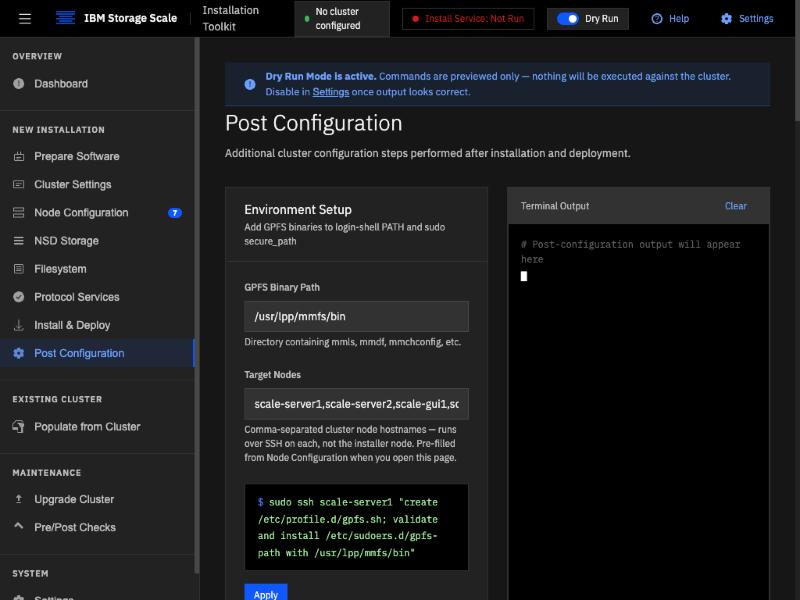

> This page also has an Environment Setup panel. It adds the GPFS binaries to the login-shell path and to the sudo secure path on the target nodes, and previews the command first, so the mm commands can be run without full paths.

### 23. Populate from Cluster

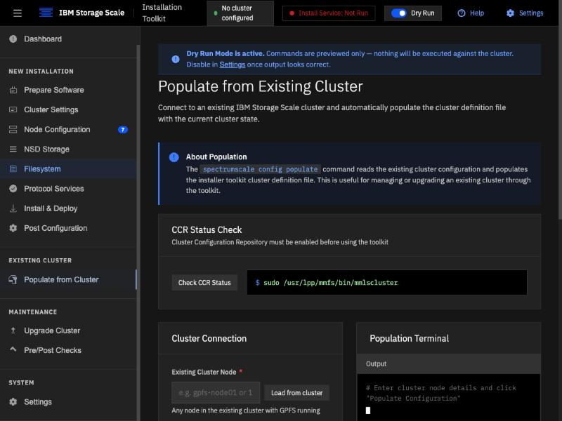

> Populate from Cluster is for an existing cluster. It checks that the Cluster Configuration Repository is enabled with mmlscluster, then reads the cluster's state into the toolkit's definition file with spectrumscale config populate. It was not run in this tour.

### 24. Pre and Post Checks

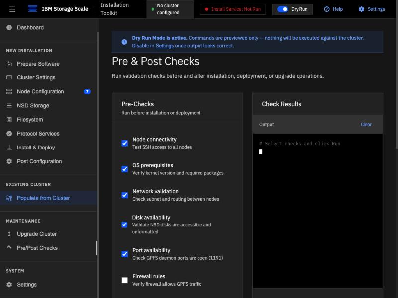

> Pre and Post Checks runs validation on demand: node connectivity, operating system prerequisites, network, disk availability, port availability and more. The panel is shown idle here. The toolkit's own prechecks and postchecks for this run are in the command-line walkthrough.

### Closing

> That is the GUI as it was used in one real installation. The configuration steps were previewed in Dry Run, and the protocols were applied live. The install and deploy ran through the MCP tools and took about forty-two minutes between them. The command-line walkthrough shows each phase with its real timing, and the MCP walkthrough shows the conversation that drove them.

## Rebuilding

Edit `_build/sources/gui-tour.json` (or replace a screenshot with the same name), then run `python3 docs/walkthroughs/_build/build_gui.py --gif` from the repository root. Pillow is needed for the GIF. The player, narration script, GIF and this page are generated; do not edit them by hand.
