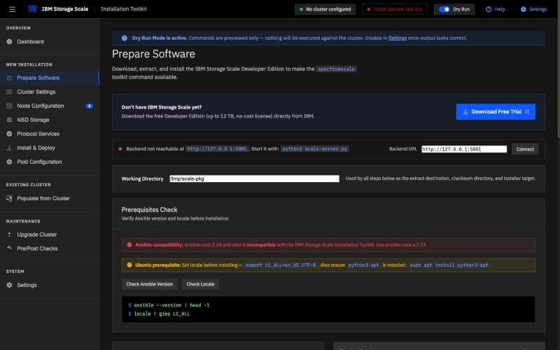
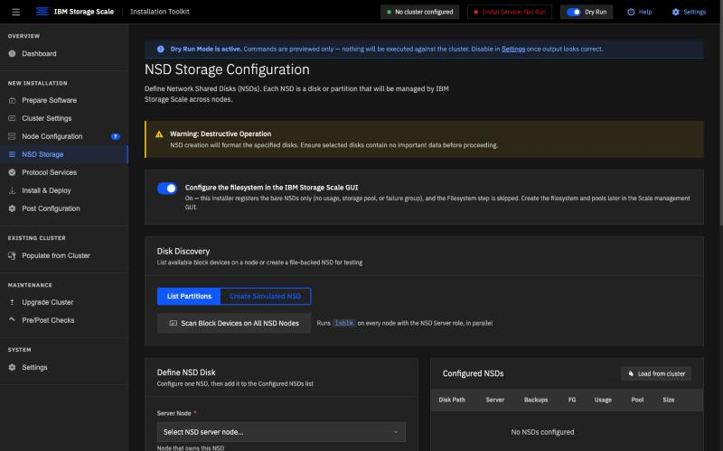
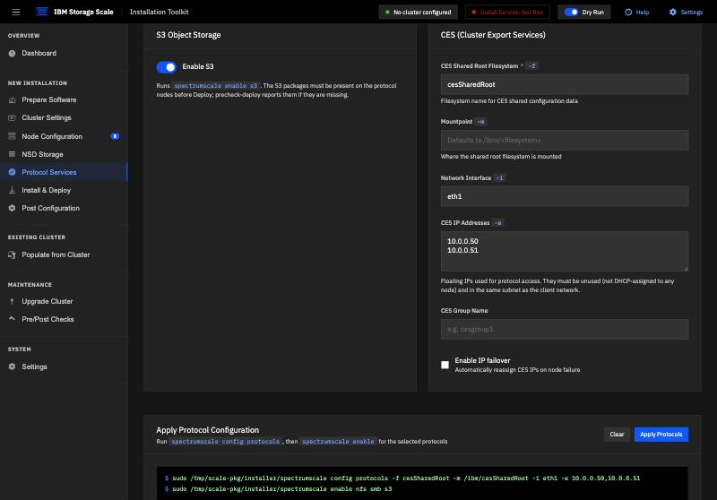
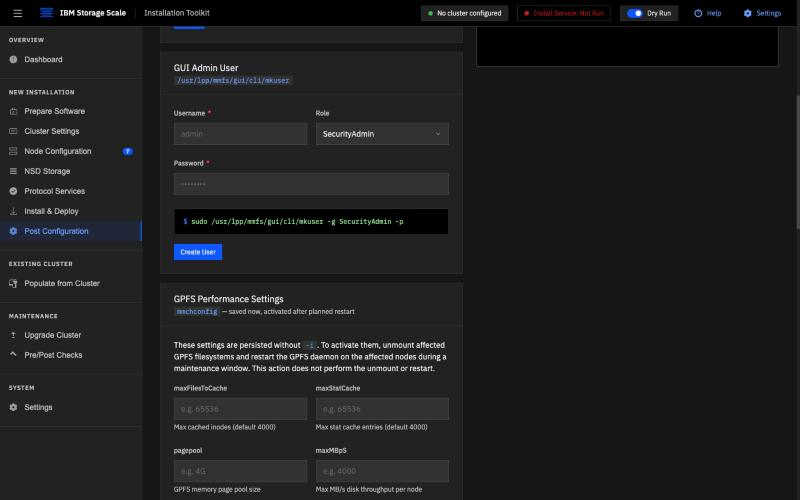

# GUI Walkthrough: Installation and Configuration

A guided tour of `Scale-GUInstall.html`, covering the settings and controls
used to prepare and configure an IBM Storage Scale cluster. The screenshots
come from a static demo server with no live backend attached, so no
`spectrumscale` installation commands are running. For the terminal
walkthrough, see [the CLI walkthrough](../cli/README.md).

Each step below pairs a screenshot with the narration you'd use if
talking over it live, the same pacing convention as the terminal
`.cast` recordings.

A self-paced recording of this sequence is at
[`recordings/gui-walkthrough.html`](player.html) —
see [Watching the recording](#watching-the-recording) below.

---

### 1. Dashboard

> "This is the toolkit’s dashboard — zero nodes, zero NSDs, zero
> filesystems, and zero protocols configured. The workflow outlines Cluster
> Settings, Node Configuration, NSD Storage, Filesystem, Protocols, and
> Install and Deploy. The command preview on the right shows the commands
> the interface generates as you configure the cluster."

### 2. Prepare Software

> "We begin by preparing the installer node. This page brings together the
> software download, working directory, and prerequisite checks. Before
> installing, use these controls to check the Ansible version and locale,
> and review the compatibility guidance shown here."

### 3. Cluster Settings

> "Cluster-wide GPFS parameters, set once before anything else runs. Notice
> the ephemeral port range is already defaulted to 60000 to 61000 — that's
> the fix for the callhome and port-range precheck failure the real
> walkthroughs hit on the first attempt, baked into the UI's defaults
> instead of left as a trap."

### 4. Node Configuration — seven nodes, roles assigned

> "Here are all seven nodes with their assigned roles: the two storage
> servers as NSD, quorum, and manager nodes; the GUI node as quorum, admin,
> and the GUI server; the two protocol nodes as manager and protocol; and
> the two clients as client-only."

### 5. NSD Storage

> "Next, we define the shared disks, or NSDs. Scan Block Devices lets you
> discover disks across the storage nodes before choosing which ones to use.
> In this example, filesystem configuration is set to happen later in the
> IBM Storage Scale GUI, so this installer skips its filesystem step."

### 6. Protocol Services — NFS, SMB, and S3 selected

> "Here we prepare NFS, SMB, and S3. The command preview shows all three
> selected. We’ve entered the shared root filesystem name, network
> interface, and floating IP addresses. Review those commands before
> choosing Apply Protocols. In live mode, configuration runs first, followed
> by protocol enablement if configuration succeeds."

### 7. Install & Deploy — the install half

> "This page brings the installation stages together. Start with the
> pre-check, run the installation, then use the post-check to verify the
> result. The command previews show what each button will run. The workflow
> also includes enabling the admin daemon before moving on to deployment."

### 8. Post Configuration

> "Once the cluster is installed, this page lets you save performance
> settings for its caches, memory, and throughput. Saving them does not
> activate them immediately. As the note explains, activation requires
> unmounting the affected filesystems and restarting the GPFS daemon during
> a planned maintenance window."

### 9. Install & Deploy — the protocol deploy half

> "Back on Install and Deploy, these controls handle protocol deployment:
> pre-check, Run Deploy, and post-check. Before a live deployment, make sure
> the shared root filesystem and protocol prerequisites are ready. If you
> use the Grafana Bridge, the note here explains why it needs to be enabled
> before deployment."

---

## About this tour

That completes our tour of the installation interface: preparing software,
defining nodes and storage, configuring protocols, and reviewing the
controls for installation and deployment. The previews and guidance help you
check each step before running it against a live cluster.

This tour explains the visible controls and command previews. It does not
show a completed installation. Filesystem creation is deferred to the IBM
Storage Scale GUI and is not demonstrated in these screenshots.

## Watching the recording

[`recordings/gui-walkthrough.html`](player.html)
is a self-contained, narration-paced slideshow of the nine screenshots
above (images embedded inline, no external files or server needed) —
each slide holds for roughly as long as its narration takes to read,
the same pacing convention as the terminal `.cast` recordings. The
companion script is
[`narration-gui-walkthrough.md`](narration.md).

Just open the file directly in a browser (double-click, or drag it in)
and screen-record it while reading the narration aloud. Space bar
pauses/resumes; arrow keys move between slides manually.
